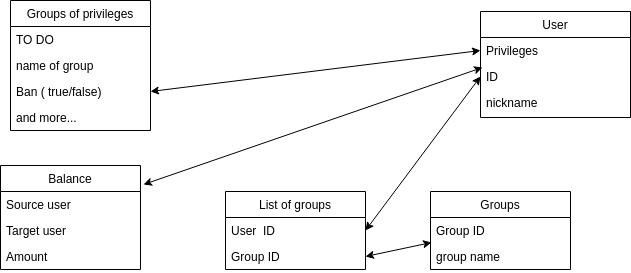

# Treasury-Department

Treasury Department for MGC

## Install python

Arch linux

	# pacman -S python`

## Getting Started

Change directory into your project.

	$ cd Treasury_Department

Create a Python virtual environment.

    $ python -m venv env

[Optional]
Activate venv for fish

	$ source {virtual_env_name}/bin/activate.fish

Upgrade packaging tools.

    $ env/bin/pip install --upgrade pip setuptools

Install the project in editable mode with its testing requirements.

    $ env/bin/pip install -e ".[testing]"

Run your project's tests.

    $ env/bin/pytest

Run your project.

    $ env/bin/pserve development.ini [--reload (for hot reload)]

## Database scheme

